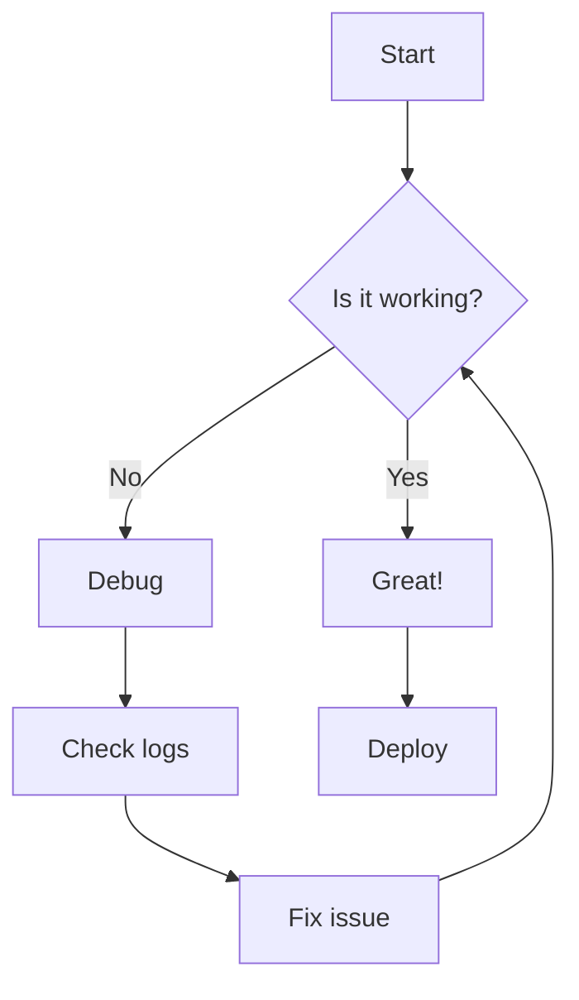
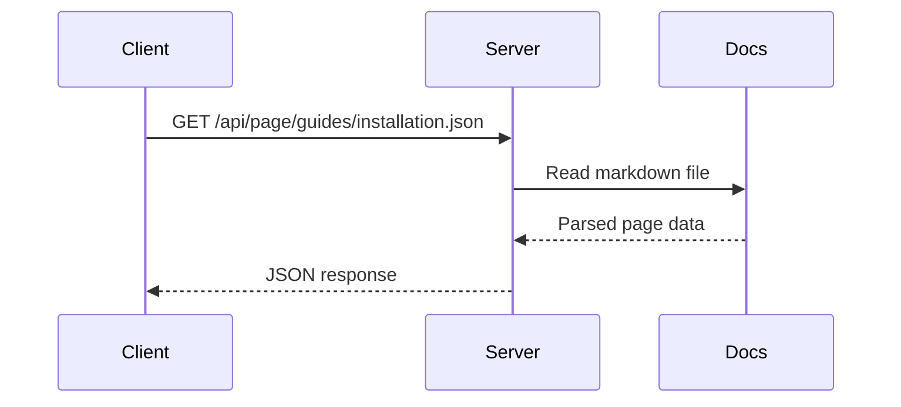
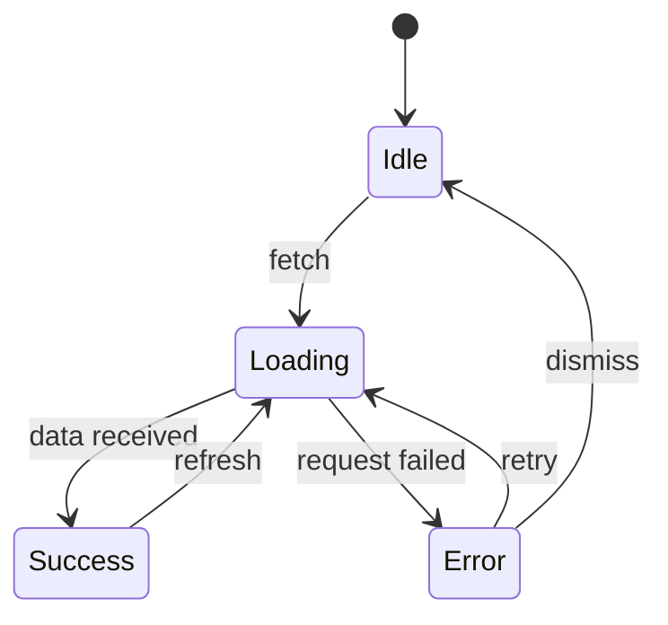
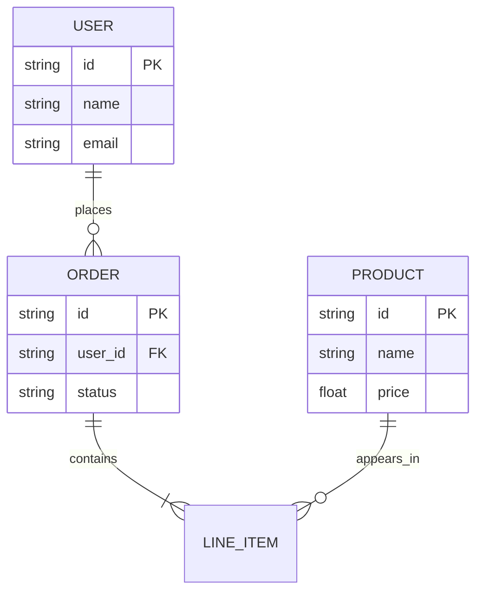
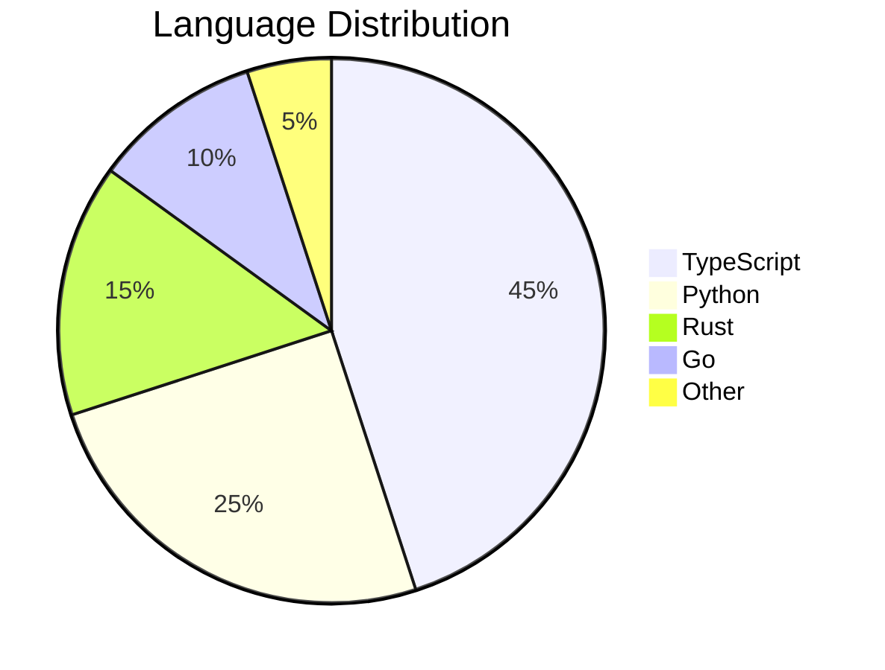
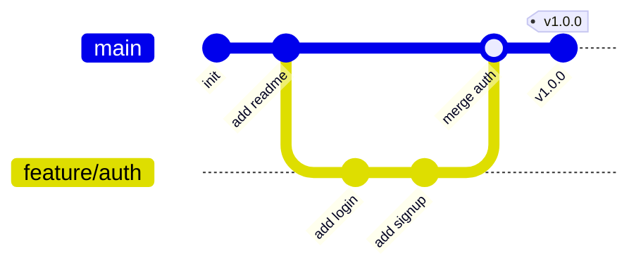

# Diagrams

mdreader renders Mermaid code fences in the browser. Diagrams follow the current light or dark theme, and readers can expand a diagram into a larger view with pan and zoom when they need more space.

## Flowchart

## Sequence Diagram

## State Diagram

## Entity Relationship

## Pie Chart

## Git Graph

## See also

- [Writing Content](/guides/writing-content)
- [CLI Reference](/reference/cli)
